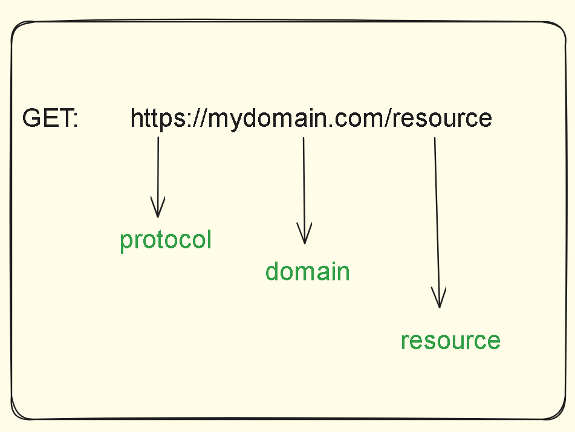
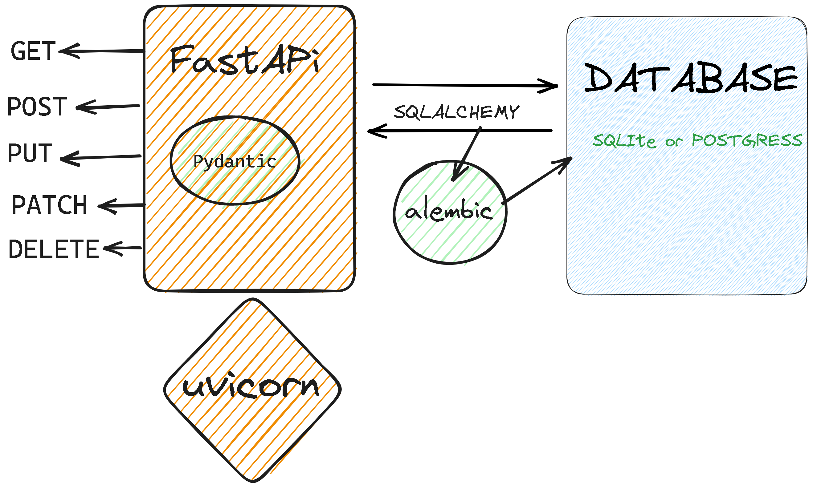

# INTRODUCTION TO API'S

## What is an API?

API (Application Programming Interface ) is a way for disparate and/or decoupled applications to communicate with each other.   
Applications can be disparate in the sense that they are developed using different programming languages which implies notable structural differences in the application.    
A decoupled application is an application whose components are developed, tested and deployed separately.   
The decoupling can be based done based on a couple of factors:
 - Backend or frontend (the frontend and backend are developed and deployed separately)
 - Modularity (the applications modules (different logical aspects of an application) are developed separately i.e for a POS system the Sales, Inventory, User and other modules are developed and deployed separately)    
The interaction is depicted in the illustration below.

   

One application will send data via the API and the other will consume the data via the API. 

It's important to note that there 3 most popular types of API's.    
    - REST (Representational State Transfer)      
    - SOAP (Simple Object Access Protocol)   
    - RPC (Remote Procedure Call)   
Our focus will be on REST API's which is the most widely used but just to pique your curiosity the difference between the 3 lies in their architectural specification.  

Rest is a constraint based architecture for creating web API's and whose services communicate using the HTTP (Hypertext Transfer Protocol).    
The details concerning REST are beyond the scope of this lesson and in the spirit of keeping things simple we won't delve deep into it's architecture design and constraints but you can leverage the following resources to  learn more. 

[What Is A RESTful API? -AWS ](https://aws.amazon.com/what-is/restful-api/)  
[What is a REST API? - REDHAT](https://www.redhat.com/en/topics/api/what-is-a-rest-api)  

## HTTP
HTTP (Hypertext Transfer Protocol) - is a protocol designed for transmitting hypermedia documents i.e Html pages, video, audio, plain text etc. It facilitates the interaction between a Client and a Server.   
The Client Makes a request and the Server responds with a response. 
The Interaction between the two is stateless. This means that each connection is treated as though it's new irrespective of wether there was an initial or subsequent requests from the same client.

## HTTP Methods (Verbs)
HTTP has 5 methods it uses to communicate to the server which correspond to the CRUD (CREATE, READ, UPDATE, DELETE) operations.

`GET` -READ -  retrieve data from the server     
`POST` -CREATE - add data to the server  
`PUT` -UPDATE -  full update of data on the server   
`PATCH` -UPDATE -  partial update of data on the server      
`DELETE` -DELETE -  delete data from the server 

When making HTTP request to server we usually target resources (web content). The resource's nature could be multimedia content, an HTML document, a link to another HTML file on a server etc. 
These resources will live at a certain location on the server also known as a URI (uniform resource identifier).    
A URI is an identifier of a specific resource on a server.

The diagram below depicts the structure of a URI

   

Example uri's include:  

http://localhost:8000/students    
http://users.com/user   

Whenever a client is making a request to the Server for a specific resources, the resource may vary depending on whatever is stored ata particular URI. We can get different types of responses from the server i.e html, json, video, images, text etc. 
When building applications that request and respond to api requests the format for data transfer is usually JSON, more details about JSON will be provided in the next topic.    

## JSON
 When interacting with an API, for data to be transferred between the systems/apps it's important to provide a neutral format for the exchange of data.    
 This is necessitated by the fact that the types in one app may not be compatible with the types in another.    
 consider Javascrpt and Python as an example.  
 `Javascript - (Number, Boolean, String etc).`     
 `Python - (int, float, str, tupl, list etc)`  
 Being that the types in the two programming langauages are incompatible, a neutral format must be incoprated to facilitate the interaction between the two.    
 There are various data agnostic formats that can be used by API's to provide and consume data.     
 `XML, RSS, CSV, JSON ` are just some of the ways. For our API's the format we will be using is `JSON`.  
 `JSON` is a lightweight, data interchange format that's easy for human beings to read and write and for machines to parse and generate.  
 It was created by Douglas Crockford. 
 JSON (Javscript Object Notation) is somewhat similar to javscript Objects save for the fact that it uses double quotation marks for the Keys while javascript can use either double or single quotation.       
 syntax:
 ```{
"key" :"value",
"key2":"value3"
 }
 ```    
 Example:
 ```
 {"id":1,
    "name":"Roy Fielding",
 }
 ```    
 Note- The fact that JSON and a javscript object are somewhat similar in structure doesn't mean they are the same type nor does it imply that they can be used directly without parsing. JSON inherited from javascript objects but it has to be parsed to a javascript object to be used in javascript. 
 ```
 JSON.stringify(object) 
 #convert from a javascript object to JSON
 JSON.parse(JSON)
 #convert from JSON to a javascript object.
 ```

## json-server

If you have ever used json server to quickly spin up a mock server, you would have noticed that it creates a couple of local URI's to interact with local data.  
For example if your data looked like this and your server was spinned at port 3000.
```
{
    "users":[
{"id":1,
"first_name":"Finn",
"last_name":"Salerg",
"email":"fsalerg0@furl.net",
"gender":"Male",
"profile":"https://randomuser.me/api/portraits/men/91.jpg"},

{"id":2,
"first_name":"Roslyn",
"last_name":"Phillott",
"email":"rphillott1@stanford.edu",
"gender":"Female",
"profile":"https://randomuser.me/api/portraits/women/27.jpg"},

{"id":3,
"first_name":"Lemar",
"last_name":"Summersby",
"email":"lsummersby2@jalbum.net",
"gender":"Male",
"profile":"https://randomuser.me/api/portraits/men/88.jpg"}
    ]
}
```
you can perfrom the following CRUD operations on the corresponding endpoints.   
 `GET http://localhost:3000/users`  -> get all users    
 `GET http://localhost:3000/users/:id` -> get a single user     
 `POST http://localhost:3000/users/` -> add a new user   
 `PATCH http://localhost:3000/users/:id`  -> partial update of an existing user  
 `PUT http://localhost:3000/users/:id`  -> partial update of an existing user   
 `DELETE http://localhost:3000/users/:id`   -> delete a user

 json-server being a mock server mimics a real server's functionality but is not robust enough to handle programming needs in production. some of it's shortfalls are
 - Inability to create your own custom endpoints as the resource name has to match the key in your json-server. in our case `/users`
 - Inability to perform validation on your data before persisting it.
 - Data is stored on a file and as there's no ACID compliance when interacting with our data. 
   
 
 That's not to say that Json-server is a bad tool that should be avoided at all cost.   
 on the contrary it's a very useful tool for testing the interaction of your frontend app will have with your server in the event that the server is not yet ready.        
 It's beginner friendly as it bypasses the complexity involved with coming up with your own server. 

 Enough of the talk on Json-server. let's have a look at it's replacement.

 # FASTAPI

 From the documentation it's a high performance, easy to learn, fast to code, ready for production web framework designed for building api's with Python 3.7+.

 There are other python frameworks available including but not limited to Tornado, Sanic, Falcon, Bottle, to mention but a few. 

 The choice of FastAPi is motivated by the fact that it's easy to learn and being a student I hope you will find it less intimidating to learn and work with.   

 As per the documentation these are the salient features of FastAPI.    
 - Fast(speed)                  
 - Robust  
 - Fewer Bugs
 - Intutive
 - short 
 - Standards Based 
 You can explore more on [the official documentation](https://fastapi.tiangolo.com/). 

 We will be using FastAPI in conjunction with a few other tools which include. 
- uvicorn -This tool is useful for running our server and allow endpoints defined by fastapi to be exposed for interaction with other applications. It's the engine in which will run our fastapi app.  
- pydantic - will be used to define our data schemas and provide validation to our data. 
- Sqlalchemy -ORM to interact with our database.
- alembic - run migrations on our database.

The diagram below depicts the workflow of our application.

 

That's all for this lesson. In the next lesson, we will introduce FastAPi installations and making Get Requests. 
## sources  
[Resources -MDN](https://developer.mozilla.org/en-US/docs/Web/HTTP/Basics_of_HTTP/Identifying_resources_on_the_Web)  
[Official Fast API Documentation](https://fastapi.tiangolo.com/)    
[Python web frameworks](https://rapidapi.com/blog/best-python-api-frameworks/)  
[What is an API?](https://www.mulesoft.com/resources/api/what-is-an-api)    
[Types of API's](https://blog.hubspot.com/website/types-of-apis)    
[API Data formats](https://wp.nyu.edu/developers/data-formats/) 
[JSON](https://www.json.org/json-en.html)   
[MDN- WHAT IS HTTP](https://developer.mozilla.org/en-US/docs/Web/HTTP)  


